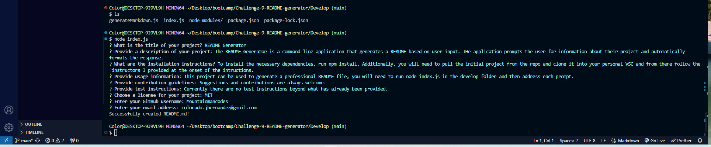

  # README Generator

  ## Project Description
    
    The README Generator is a command-line application that generates a README based on user input. THe application prompts the user for information about their project and automatically formats the response.
    
  ## Table of Contents
    
    - [Installation](#installation)
    - [Usage](#usage)
    - [License](#license)
    - [Contributing](#contributing)
    - [Tests](#tests)
    - [Questions](#questions)
    
  ## Installation
    
    To install the necessary dependencies, run npm install. Additionally, you will need to pull the initial project from the repo and clone it into your personal VSC and from there follow the instructors I provided at the onset of the intructions. 
    
  ## Usage
    
    This project can be used to generate a professional README file, you will need to run node index.js in the develop folder and then address each prompt.

  ## Example

    
    
  ## License
  
  This application is covered under the [MIT](https://opensource.org/licenses/MIT) license.

  ## Contributing
    
    Suggestions and contributions are always welcome.
    
  ## Tests
    
    Currently there are no test instructions beyond what has already been provided.
    
  ## Questions
    
    For any questions, please contact me with the information below:
    
    GitHub: [Mountainmancodes](https://github.com/Mountainmancodes)  
    Email: colorado.jhernandez@gmail.com
  